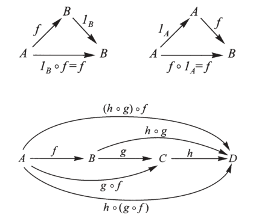

# Category

-   A category can be thought as a "mathematical universe"
-   There are many categories
-   There are ways to pass from one category to another ([[functor]])
-   Mathematics involves different categories and their relationships

## Data

-   Objects: $A$,$B$,$C$, etc
-   Morphisms: $f : A \to B$, etc
-   Identity morphisms:
    -   $id_A : A \to A$
    -   1 per object
-   Composition:
    -   $A \xrightarrow{g} B$
    -   $B \xrightarrow{f} C$
    -   $A \xrightarrow{f \circ g} C$

## Morphisms rules

-   Left identity
    -   $f : A \to B$
    -   $id_B \circ f = f$
-   Right identity
    -   $g : A \to B$
    -   $g \circ id_A = g$
-   Associativity
    -   $A \xrightarrow{f} B \xrightarrow{g} C \xrightarrow{h} D$
    -   $A \xrightarrow{h \circ (g \circ f) = (h \circ g) \circ f} D$
    
    

