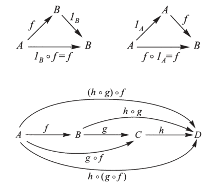

# Table of Contents

1.  [Data](#org8bb50e1)
    1.  [Morphisms rules](#orgfafaf10)
2.  [See also](#orgcd79d38)

-   **tags:** [Category-Theory](../../../.local/share/Trash/files/20200824163944-category_theory.md)

-   A *category* can be thought as a &rsquo;mathematical universe&rsquo;
-   There are many categories
-   There are ways to pass from one category to another
-   Mathematics involves different categories and their relationships

# Data

-   **Objects**: *A*,/B/,/C/,&#x2026;
-   **Morphisms**: \(f : A \to B\), etc
-   **Identity morphisms**:
    -   \(id_A : A \to A\)
    -   1 per object
-   **Composition**:
    -   \(A \xrightarrow{g} B\)
    -   \(B \xrightarrow{f} C\)
    -   \(A \xrightarrow{f \circ g} C\)

## Morphisms rules

-   Left identity
    -   \(f : A \to B\)
    -   \(id_B \circ f = f\)
-   Right identity
    -   \(g : A \to B\)
    -   \(g \circ id_A = g\)
-   Associativity
    
    -   \(A \xrightarrow{f} B \xrightarrow{g} C \xrightarrow{h} D\)
    -   \(A \xrightarrow{h \circ (g \circ f) = (h \circ g) \circ f} D\)
    
    

# See also

-   [Identity Morphism](20200824185122-identity_morphism.md)

